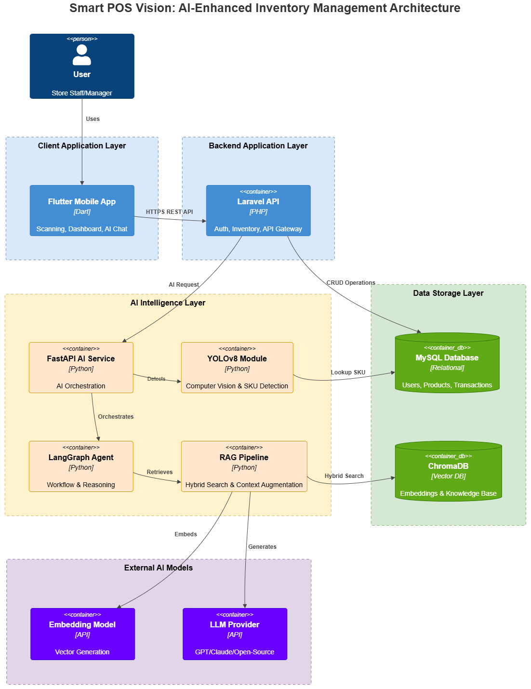

# 🛒 Smart POS Vision: AI-Enhanced Inventory Management (Demo)

 

  <!-- Tech Stack Badges -->
  
  
  
  
  

 

> Smart POS Vision is an end-to-end commercial retail solution that seamlessly merges traditional Point of Sale workflows with cutting-edge Artificial Intelligence. Built with a stunning Neumorphic Flutter UI, it leverages YOLOv8 computer vision for automated stock counting and a LangGraph-powered Agent for real-time, stateful data insights.

## ✨ Key Features

*   **📱 Neumorphic UI Experience:** A fully custom, highly responsive Flutter mobile interface featuring fluid animations and localized stateful loading indicators.
*   **📸 Hybrid AI Vision Engine:** Architected a strict "SKU-First" workflow that pairs exact barcode scanning with YOLO-based computer vision quantification—guaranteeing 100% database integrity and eliminating AI hallucinations (ghost records).
*   **🧠 Real-Time AI Retail Agent:** Engineered a LangGraph SQL Agent featuring ChromaDB RAG. It dynamically queries live MySQL data to answer complex inventory questions, delivering a ChatGPT-like "typing effect" via highly optimized Server-Sent Events (SSE) streaming.
*   **🏢 Enterprise-Grade Admin Ecosystem:** Backed by a robust Laravel API and a comprehensive Filament PHP dashboard for real-time inventory tracking, pricing, and product knowledge management.

---

## 🏗️ Microservice Architecture

The ecosystem operates on a decoupled, highly scalable architecture:

1.  **Frontend (Mobile):** **Flutter & GetX** — Handles reactive state management, camera interactions, and SSE stream parsing.
2.  **Core Backend (API & Admin):** **Laravel & Filament PHP** — Acts as the secure gateway, enforcing strict data validation and managing SKU transactions.
3.  **AI Microservice (Vision & LLM):** **Python & FastAPI** — Runs the robust, data-augmented YOLOv8 model and orchestrates the LangGraph AI workflows.

---

## 🏗️ System Architecture

Smart POS Vision follows an end-to-end AI application architecture combining computer vision, LLM agents, RAG pipelines, and full-stack services.

## 📸 Gallery & Demo

Dashboard | AI Vision Counter | RAG Chat Assistant (Streaming) |
| :---: | :---: | :---: |
 |  |  |

| Product Knowledge | Web Inventory Details |
| :---: | :---: |
|  |  |

**🎥 [Watch the full Demo Video here](docs/demo-video.mp4)**
